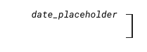
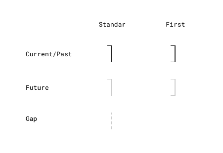

# Timelinez - Specifiche di Progetto

## Panoramica
Timelinez è un'applicazione web Ruby on Rails progettata per la visualizzazione di eventi su un asse temporale. L'applicazione può essere utilizzata per rappresentare qualsiasi successione di eventi, dall'intera vita di una persona alla documentazione delle fasi di un progetto, passando per la cartella clinica di un paziente.

## Concetti Base

Un evento in Timelinez rappresenta un'occorrenza temporale all'interno di una timeline. Gli eventi possono essere di due tipologie: eventi che durano un singolo giorno (*1-day*) o eventi che si estendono su più giorni (*multi-day*). 

Ogni evento ha uno stato che ne determina la completezza temporale. Un evento si considera *chiuso* quando sono specificate sia la data di inizio che quella di fine, mentre è *aperto* quando è specificata solo la data di inizio. Per garantire la coerenza dei dati, tutti gli eventi di tipo *1-day* sono automaticamente considerati *chiusi*, e tutti gli eventi futuri devono necessariamente specificare una data di fine.

## Visualizzazione e Rappresentazione

La visualizzazione degli eventi si basa sul concetto di unità temporale, che rappresenta il più piccolo intervallo di tempo visualizzabile sulla timeline. L'utente può scegliere tra quattro diverse granularità di visualizzazione: giorni, settimane, mesi o anni. Questa flessibilità permette di adattare la visualizzazione alle diverse esigenze di rappresentazione temporale.

Gli eventi sulla timeline sono organizzati in gruppi logici basati sulla loro sovrapposizione temporale. Un gruppo si forma quando due o più eventi condividono almeno una stessa unità temporale. È importante notare che un singolo evento può appartenere a più gruppi, e la composizione di questi gruppi viene dinamicamente ricalcolata ogni volta che l'utente cambia la granularità di visualizzazione.

Per migliorare la leggibilità della timeline, introduciamo il concetto di "unità gap", elementi visivi che connettono gruppi di eventi non contigui. Due gruppi si considerano non contigui quando esiste almeno un'unità temporale vuota tra di essi.

### Unità Temporali
Le timeline sono composte da unità temporali che variano in base alla visualizzazione selezionata:
- Giorni
- Settimane
- Mesi
- Anni

### Gruppi di Eventi
- Un gruppo è costituito da eventi che condividono almeno una stessa unità temporale
- Un evento può appartenere a più gruppi
- La composizione dei gruppi viene ricalcolata ad ogni cambio di visualizzazione

### Unità Gap
- Connettono gruppi di eventi non contigui
- Si definiscono non contigui quando tra due gruppi c'è almeno un'unità temporale senza eventi

### Stile delle Unità Temporali
- **Unità Standard**:
  - Linea verticale 34px x 8px
  - Allineata a destra nella cella della griglia
  - Tacca superiore di 1px x 8px

- **Unità Iniziale**:
  - Include una tacca di inizio unità
  - Si applica alla prima unità di ogni gruppo

- **Unità Gap**:
  - Linea verticale tratteggiata
  - Colore: #CCCCCC

Di seguito un prontuario completo delle unità temporali che mostra tutte le possibili combinazioni di colore, tratto, presenza della tacca o delle tacche, per eventi passati/in corso e futuri:

## Funzionalità Core

### Gestione Timeline
Il sistema permette la creazione e gestione di multiple timeline, ciascuna identificata da un nome univoco. Per ogni timeline, l'applicazione calcola e visualizza la durata complessiva basata sugli eventi contenuti. È possibile eliminare una timeline, operazione che comporta la rimozione automatica di tutti gli eventi ad essa associati.

### Gestione Eventi
All'interno di ogni timeline, gli utenti possono creare e gestire eventi. Ogni evento deve specificare una data di inizio obbligatoria e può includere una data di fine (obbligatoria solo per eventi futuri). Gli eventi sono caratterizzati da un nome o descrizione e possono essere personalizzati con un colore specifico (se non specificato, viene assegnato il colore predefinito #00A3D7). Il sistema calcola automaticamente la durata di ciascun evento e verifica che la data di fine, quando specificata, sia successiva alla data di inizio.

### Funzionalità di Calcolo
Il sistema offre funzionalità avanzate di calcolo temporale. Per ogni evento, la durata viene calcolata e presentata in diverse unità di misura: giorni, settimane e mesi. Il sistema gestisce in modo particolare gli eventi in corso (privi di data di fine), utilizzando la data corrente come riferimento per i calcoli. Inoltre, per ogni timeline viene calcolata la durata complessiva considerando tutti gli eventi contenuti.

## Modelli Dati

### Timeline
Il modello Timeline rappresenta il contenitore principale degli eventi. Ogni timeline è caratterizzata da un nome obbligatorio (string) e include i timestamp standard created_at e updated_at per il tracciamento temporale. Una timeline può contenere molteplici eventi, implementando una relazione has_many con il modello Event.

### Event
Il modello Event rappresenta i singoli eventi all'interno di una timeline. Ogni evento è caratterizzato da:
- Una data di inizio obbligatoria (start_date)
- Una data di fine opzionale (end_date), che diventa obbligatoria per eventi futuri
- Un colore personalizzabile (color)
- Un riferimento alla timeline di appartenenza (timeline_id)
- I timestamp standard (created_at, updated_at)
- Un tipo che può essere '1-day' o 'multi-day' (type)
- Uno stato che può essere 'closed' o 'open' (status)

Ogni evento appartiene a una singola timeline, implementando una relazione belongs_to.

## Comportamenti Tecnici
L'applicazione implementa diversi comportamenti tecnici automatizzati per garantire la consistenza e l'efficienza del sistema. Quando un evento viene modificato, il timestamp della timeline associata viene automaticamente aggiornato. Per i nuovi eventi, se non viene specificato un colore, il sistema ne assegna automaticamente uno predefinito.

Il sistema gestisce dinamicamente il calcolo delle durate, considerando la data corrente per gli eventi ancora in corso. Quando una timeline viene eliminata, tutti gli eventi associati vengono automaticamente rimossi (cancellazione a cascata). Inoltre, ogni volta che l'utente cambia la visualizzazione, il sistema ricalcola automaticamente i gruppi di eventi per garantire una rappresentazione accurata.

## Interfaccia Utente
L'interfaccia utente è progettata per offrire un'esperienza intuitiva e completa. Gli utenti hanno accesso a una vista d'insieme di tutte le timeline disponibili, con la possibilità di esplorare nel dettaglio ciascuna timeline e i suoi eventi. L'interfaccia include form intuitivi per la creazione e modifica di timeline ed eventi, con indicatori visivi che rappresentano chiaramente la durata degli eventi e la loro progressione temporale.

Un selettore permette di modificare la granularità della visualizzazione (giorni, settimane, mesi, anni), e tutte le unità temporali sono rappresentate secondo le specifiche di stile definite, garantendo una visualizzazione coerente e professionale.

## Validazioni e Controlli
Il sistema implementa un robusto sistema di validazioni per garantire l'integrità dei dati. Per le timeline, viene verificata la presenza obbligatoria del nome. Per gli eventi, oltre alla verifica della presenza della data di inizio, il sistema controlla la coerenza temporale tra data di inizio e fine, implementa validazioni specifiche per gli eventi futuri (richiedendo la data di fine) e verifica la correttezza del tipo di evento (1-day vs multi-day).

Tutti gli errori di validazione vengono gestiti appropriatamente, fornendo feedback chiari all'utente.

## Gestione Fuso Orario
L'implementazione della gestione del fuso orario segue un approccio incrementale. Nella prima fase, l'applicazione si concentra sul mercato italiano con un'implementazione base. Successivamente, in previsione dell'espansione internazionale, verrà implementato il supporto completo multi-timezone. In ogni caso, le date degli eventi devono sempre essere visualizzate nel fuso orario dell'utente finale.

## Prestazioni e Scalabilità
Per garantire prestazioni ottimali anche con grandi quantità di dati, l'applicazione implementa diverse strategie di ottimizzazione. Le query per il calcolo delle durate sono ottimizzate per minimizzare il carico sul database, mentre le relazioni tra timeline ed eventi sono gestite in modo efficiente per ridurre il numero di query necessarie.

L'implementazione di touch: true garantisce aggiornamenti efficienti dei timestamp, mentre il ricalcolo dei gruppi di eventi è ottimizzato per mantenere le prestazioni anche con timeline complesse. 