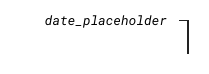
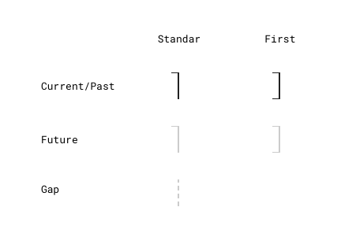

# Timelinez

Timelinez è un'applicazione per la visualizzazione di eventi su un asse temporale. Può essere usata per rappresentare qualsiasi successione di eventi, dall'intera vita di una persona alla documentazione delle fasi di un progetto, passando per la cartella cliica di un paziente.

## Concetti base

Una timeline può essere composta da un numero indefinito di eventi e ciascun evento può appartenere a una timeline soltanto. Esistono due **tipologie** di eventi: *1-day* (eventi che durano un giorno soltanto) oppure *multi-day* (eventi che durano più di un giorno). 
Lo **stato** di un evento può essere *chiuso* (data_inizio e data_fine entrambe specificate) oppure *aperto* (data_inizio specificata, data_fine non specificata). 
Tutti gli eventi di tipo *1-day* hanno, per definizione, lo stato *chiuso*. Inoltre, tutti gli eventi *nel futuro* possono avere soltanto lo stato *chiuso* (non deve essere possibile creare eventi nel futuro senza specificare la data_fine).

## Rappresentazione degli eventi su una timeline

Ciascuna timeline è composta da **unità temporali** che rappresentano una arco di tempo variabile a seconda della **visualizzazione**: se qust'ultima è di tipo *giorni* allora ciascuna unità temporale rappresenta la durata di un giorno, se è di tipo *settimane* allora ciascuna unità temporale rappresenta la durata di una settimana, e così via. 

La visualizzazione può essere modificata dall'utente tramite l'interfaccia e può essere di tipo *giorni*, *settimane*, *mesi* o *anni*.

Le **unità temporale** possono anche essere di tipo *gap*, che servono a  connettere *gruppi di eventi non contigui*. Due gruppi di eventi vengono definiti *non contigui* quando tra uno e l'altro 'c'è *almeno unità temporale a cui non appartiene alcun evento*.

Un **gruppo di eventi** è costituito dall'insieme di eventi che condividono almeno una stessa unità tempoerale. Ne consegue che ciascun **evento** può appartnenere a più gruppi di eventi.

La composizione di un **gruppo di eventi** può cambiare in fuzione della **visualizzazaione**: due eventi potrebbero condividere lo stesso mese e quindi appartenere allo stesso gruppo nella *visualizzazione "mesi"*, ma potrebbero non condividere la stessa settimana e quindi non appartnere allo stesso gruppo nella *visualizzazione "settimane"*.

Ne consegue che la composizione dei gruppi di eventi deve essere ricalcolata a ogni *variazione della visualizzazione*.

## Stile delle unità temporali

Ciascuna **unità temporale standard** è caratterizzata da una linea verticale alta 34px e larga 8px allineata alla destra della cella della griglia che contiene tutte le unità temporali.

Allineata in alto a destra è presente una *tacca di fine unità temporale* alta 1px e larga 8px, di fine dell'unità temporale (fine del giorno, fine della settimana, e così via).

Nel caso di **unità temporale iniziale**, cioè quando l'unità temporale è la prima del proprio gruppo di appartenenza, anche quando il gruppo è costituito da una untà soltanto, allora dovrà avere anche una *tacca di inizio unità temporale*. Le unità temporali *gap* sono eslcude dal conteggio.

Le unità **gap** vengono rappresentate con una linea verticale tratteggiata di colore "#CCCCCC".

Di seguito un prontuario delle **unità temporali** che raccoglie tutte le possibili combinazioni di colore, tratto, presenza della tacca o delle tacche, per eventi passati/in corso e futuri.

## Interfaccia utente

## Gestione fuso orario

Le date degli eventi devono sempre essere rappresentate usando il *fuso orario dell'utente*. Inizialmente l'applicazione verrà commmercializzata soltanto in Italia, ma è previsto che venga commercializzata anche all'estero.
Durante la prima fase di commercializzazione può essere accantonata la gestione del fuso orario, che verrà implementata in seguito.

## Architettura tecnica

## Performance